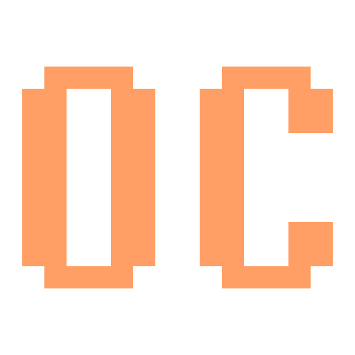

<p align="center">
  
</p>

<h1 align="center">Omacut</h1>

<p align="center">
  Screen capture that hands off. Screenshots an AI agent can act on, made for Omarchy.
</p>

<p align="center">
  <a href="LICENSE"></a>
  <a href="https://omacut.com"></a>
</p>

---

Omarchy already takes screenshots and records the screen. What it has no answer
for is the **hand-off**: turning what you just saw into something an agent can
act on. That is all Omacut does.

Press a key, drag a region, type a note. Keep going. When you are done, the
whole batch is on your clipboard as paths and notes, or as a folder with a
`bundle.md` an agent reads top to bottom. No account, no upload, no telemetry:
everything is plain files under `~/Omacut/`.

Omacut is a fork of [QACut](https://github.com/mcinnisdev/qacut), rebuilt around
Omarchy's own picker, keys, menu and themes. The capture, bundle and markup code
is shared; the desktop integration is not.

## It wears your theme

Omacut has no palette of its own. Omarchy renders its colours from whatever
theme you are on, and the app follows along — windows and tray mark alike —
the moment you switch. Nothing to configure.

That is one template file, `omarchy/themed/omacut.css.tpl`. There is no
theme-set hook: the app watches the rendered stylesheet and re-skins itself.

## Three modes

| | Mode | For | How |
| --- | --- | --- | --- |
| **1** | **Basic** · quick shots | One fix, or three, for an agent; or a marked-up screenshot for a person. | `SUPER+ALT+Q`, drag, mark up, note. Finish and the paths and notes land on the clipboard; **Copy image** puts the marked-up PNG there instead. |
| **2** | **Bundles** · bigger jobs | A fix list across a whole app, or the raw material for a process doc. | `SUPER+ALT+C` for a shot, `SUPER+ALT+A` to auto-capture a process. Group by page, note each shot, finish, hand the folder over. |
| **R** | **Studio** · recordings for people | A walkthrough someone will actually watch. | `SUPER+ALT+V`. Cursor smoothing, click ripples, follow zooms, camera bubble, narration, trim and cut, MP4 out. |

A bundle is a folder: screenshots in groups, a note on each, and a `bundle.md`
that reads top to bottom with every image linked relatively.

```
~/Omacut/2026-09-19_143022-settings-review/
  bundle.md              everything in reading order, images linked relatively
  manifest.json          the same data, structured
  01-settings-page/      01.png 02.png 03.png
  02-billing/            01.png
```

Set `$OMACUT_DIR` to put that somewhere else.

## Keys

The compositor owns the keys, because Wayland has no global hotkey API and an
app that claims otherwise is lying to you. Every binding runs `omacut <verb>`,
which reaches the running app over a socket — and starts it first if it is not
up, so the first press after a login just works.

| Key | Command | Does |
| --- | --- | --- |
| `SUPER+ALT+Q` | `omacut quick` | **Q**uick shot |
| `SUPER+ALT+C` | `omacut capture` | **C**apture a region into the bundle |
| `SUPER+ALT+A` | `omacut record` | **A**uto-capture start / stop |
| `SUPER+ALT+N` | `omacut group` | **N**ew group |
| `SUPER+ALT+B` | `omacut peek` | **B**undle window |
| `SUPER+ALT+E` | `omacut finish` | **E**nd the bundle and copy its path |
| `SUPER+ALT+V` | `omacut studio` | **V**ideo: Studio recording start / stop |
| `SUPER+ALT+Z` | `omacut zoom` | Mark a **z**oom, while recording |

Every one of those is a chord Omarchy leaves free, so installing Omacut
unbinds nothing. `SUPER+SHIFT+1..9` stays on *move window to workspace* and
`SUPER+ALT+1..5` stays on the window groups.

Everything is also in the Omarchy menu under **Omacut**, and `omacut help`
lists the verbs.

## Install

Not packaged yet. From source, with Node 22+, a Rust toolchain and the
[Tauri prerequisites](https://v2.tauri.app/start/prerequisites/):

```bash
git clone https://github.com/mcinnisdev/omacut
cd omacut
npm install
npm run tauri build
./omarchy/install.sh          # theme template, keys and menu entries
```

`install.sh` is additive and idempotent, skips anything you have edited
yourself, and `--uninstall` takes it back out. It adds four things: the theme
template, the key bindings, the menu entries, and one window rule that opts
Omacut out of Omarchy's default window opacity — a review surface you are
marking screenshots up in should show the pixels you captured and nothing
behind them.

## Status

Honest about where this is:

- **Basic and Bundles** work on Omarchy. Region picking goes through
  `omarchy-capture-region`, so it snaps to windows and monitors exactly like a
  screenshot does, and stills are captured through wlroots screencopy.
- **Studio** edits, composites and exports on Linux, but **recording a source
  is still Windows-only**. The Linux path will go through
  `gpu-screen-recorder`, which Omarchy already ships.
- **Keystroke badges** and click-triggered auto-capture need `/dev/input`
  access that Wayland does not hand out. Auto-capture falls back to interval
  stills; badges are not available yet.
- Windows still builds. The Omarchy-specific pieces are behind `cfg`, and the
  capture, bundle and markup code is shared.

## Development

Tauri 2: a Rust backend and vanilla TypeScript built with Vite.

```bash
npm run tauri dev
npm run build                 # type-check and bundle
cd src-tauri && cargo test
```

```
src/                capture, note, peek (bundle), rec, edit, prompts, theme
src/studio/         compositor, timeline, export (WebCodecs)
src-tauri/src/      main.rs (tray, commands), capture.rs, export.rs, model.rs
src-tauri/src/      picker.rs (Omarchy region picking), ipc.rs (the CLI), theme.rs
omarchy/            theme template, key bindings, menu entries, install.sh
scripts/logo.py     the mark, as pixel art, at any size and any colour
```

The mark is a 16x16 pixel grid scaled by whole numbers, so it is crisp at every
icon size and can be re-rendered in any accent:

```bash
python3 scripts/logo.py --ascii
./scripts/icons.sh            # regenerate every icon
```

---

MIT. Made by [Nick McInnis](https://github.com/mcinnisdev).
